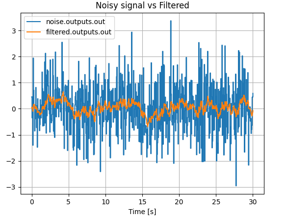

# pySimBlocks

A deterministic block-diagram simulation framework for discrete-time modeling, 
co-simulation and research prototyping in Python.

pySimBlocks allows you to build, configure, and execute discrete-time systems 
using either:

- A pure Python API
- A graphical editor (PySide6)
- YAML project configuration
- Optional SOFA and hardware integration


## Features

- Block-based modeling (Simulink-like)
- Deterministic discrete-time simulation engine
- PySide6 graphical editor
- YAML-based project serialization
- Exportable Python runner (`run.py`)
- Extensible block architecture

## Installation

### From GitHub

Install directly from GitHub using pip:
```
pip install git+https://github.com/AlessandriniAntoine/pySimBlocks
```

### Locally

Clone the repository and install locally:
```
git clone https://github.com/AlessandriniAntoine/pySimBlocks.git
cd pySimBlocks
pip install .
```

## Getting Started

### Quick Example

The following example models a simple first-order low-pass filter, defined by
the difference equation:

$$ y[k] =  \alpha x[k] + (1-\alpha) y[k-1] $$

It can be implemented in pySimBlocks using the following code:

```python
from pySimBlocks import Model, Simulator, SimulationConfig, PlotConfig
from pySimBlocks.blocks.operators import Gain, Sum, Delay
from pySimBlocks.blocks.sources import WhiteNoise
from pySimBlocks.project.plot_from_config import plot_from_config

# 1. Create the blocks
noise = WhiteNoise(name="noise", std=1.0)
delay = Delay(name="delay")
filtered = Sum("filtered", signs="++")
alpha_gain = Gain(name="alpha", gain=0.1)
complement = Gain(name="complement", gain=0.9)

# 2. Build the model
model = Model("Example")
for block in [noise, delay, filtered, alpha_gain, complement]:
    model.add_block(block)

model.connect("noise", "out", "alpha", "in")
model.connect("delay", "out", "complement", "in")
model.connect("alpha", "out", "filtered", "in1")
model.connect("complement", "out", "filtered", "in2")
model.connect("filtered", "out", "delay", "in")

# 3. Simulate the model
sim_cfg = SimulationConfig(dt=0.05, T=30.)
sim = Simulator(model, sim_cfg)
logs = sim.run(logging=["noise.outputs.out", "filtered.outputs.out"])

# 4. Plot the results
plot_cfg = PlotConfig([
    {"title": "Noisy signal vs Filtered",
     "signals": ["noise.outputs.out", "filtered.outputs.out"],},
    ])
plot_from_config(logs, plot_cfg)
```

The resulting plot should look like this:



See [examples/quick_start/filter.py](./examples/quick_start/filter.py)
to run the example yourself.

### Graphical Editor

The exact same model can be constructed visually using the graphical editor (as
shown in the image above of this README).

To open the graphical editor, run:
```bash
pysimblocks gui examples/quick_start/gui
```

The quick-start GUI project is stored in a single
[examples/quick_start/gui/project.yaml](./examples/quick_start/gui/project.yaml) file.

### Learning Resources


#### Tutorials

Three step-by-step tutorials are available detailed in the
[guide](./docs/User_Guide/getting_started.md):

  | | Tutorial | Description |
  |---|---|---|
  | 1 | [Python API](./docs/User_Guide/tutorial_1_python.md) | Build a closed-loop PI control system in pure Python |
  | 2 | [GUI](./docs/User_Guide/tutorial_2_gui.md) | Build the same system visually with the graphical editor |
  | 3 | [SOFA](./docs/User_Guide/tutorial_3_sofa.md) | Replace the plant with a SOFA physics simulation |


#### Other Examples

A collection of basic and advanced examples is available in the
[examples](./examples) directory, including:

- Control system demonstrations
- SOFA-based simulations
- Hardware and real-time use cases
- Comparisons with external tools

See [examples/README.md](./examples/README.md) for an overview.

## Information

### License

pySimBlocks is licensed under [LGPL-3.0-or-later](./LICENSE.md).

---
© 2026 Université de Lille & INRIA – Licensed under LGPL-3.0-or-later
