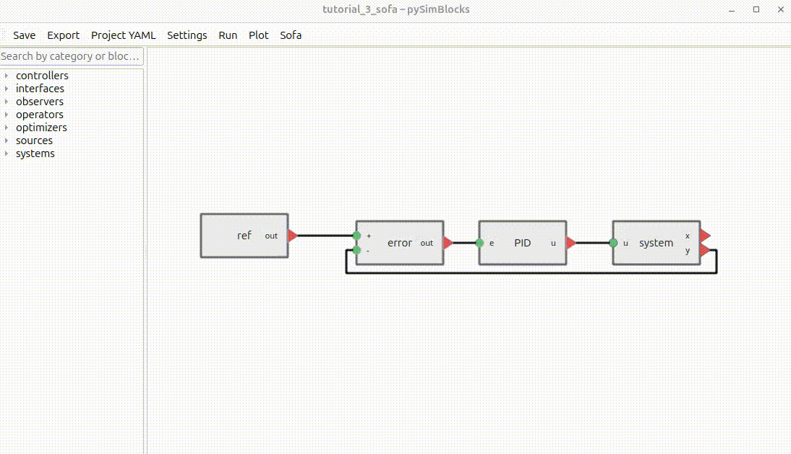
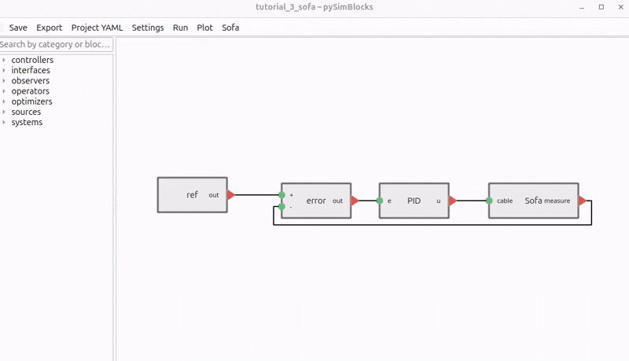
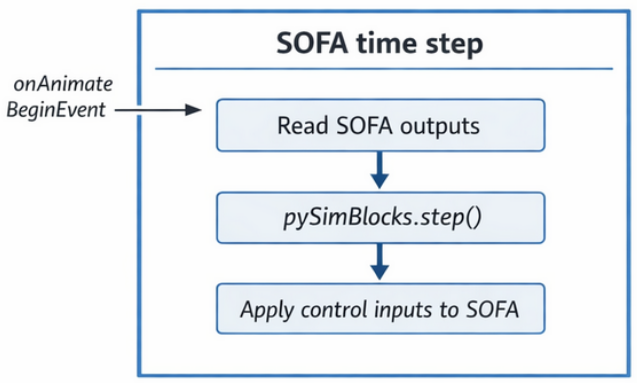
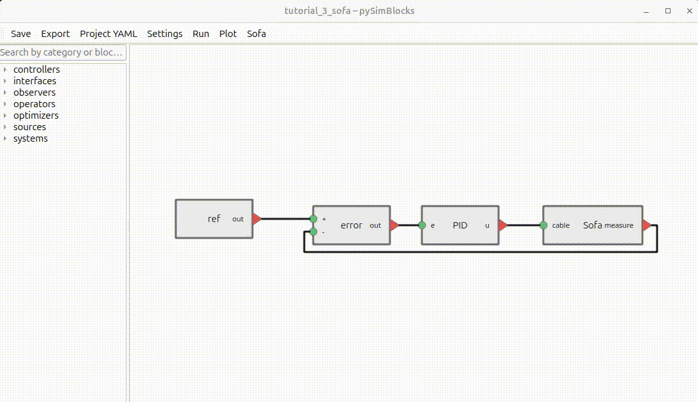

# Tutorial 3 — Coupling pySimBlocks with SOFA

## 1. Overview

This tutorial builds on the closed-loop system introduced in [Tutorial 1](./tutorial_1_python.md) and [Tutorial 2](./tutorial_2_gui.md). We demonstrate how **pySimBlocks can be coupled with SOFA** 
to control and interact with a physics-based simulation.

### 1.1 Goals

The main objectives of this tutorial are to:
- Show how to set up environment variables to couple pySimBlocks with SOFA
- Replace the linear plant from previous tutorials with a SOFA simulation
- Create a SOFA controller to receive and send signals to pySimBlocks
- Run the coupled simulation and visualize results

### 1.2 System Description

We build a simple closed-loop control system composed of three elements: 
- a constant reference, 
- a PI controller, 
- a SOFA simulation.


The SOFA simulation is a finger actuated by a tendon. 
The control input is the tendon tension, and the output is the vertical position of the fingertip.
The files for the SOFA scene can be found in the [tutorial_3_sofa
folder](../../examples/tutorials/tutorial_3_sofa/finger).

 

## 2. Prerequisites — Environment Setup

Before coupling **pySimBlocks** with SOFA, you must install SOFA and configure
your environment so that:

- Python can import the `Sofa` module
- `runSofa` can be located from your system
- pySimBlocks can launch and interact with SOFA

### 2.1 Install SOFA

First, install SOFA from the [website](https://www.sofa-framework.org/download/) either:
- Using the precompiled binaries (recommended for most users)
- Building from source (advanced users). Be sure to have SofaPython3 plugin.

After installation, identify your main SOFA directory:

- For a binary release: the extracted folder (containing `bin/`, `plugins/`, etc.)
- For a compiled version: the build directory


### 2.2 Set Environment Variables

To enable coupling, you need to set the following environment variables:
- `SOFA_ROOT`: Path to your SOFA installation
```bash
export SOFA_ROOT=/path/to/your/sofa
```
- `PYTHONPATH`: Include the SOFA Python bindings site-packages.
    - If you installed SOFA from binaries, this is typically:
    ```bash
    export PYTHONPATH=$SOFA_ROOT/plugins/SofaPython3/lib/python3/site-packages:$PYTHONPATH
    ```
    - If you built SOFA from source, it may be:
    ```bash
    export PYTHONPATH=$SOFA_ROOT/lib/python3/site-packages:$PYTHONPATH
    ```

### 2.3 Verify the Setup

To verify that the setup is correct, open a Python terminal and try 
importing the `Sofa` module:
```python
import Sofa
import SofaRuntime
```
This should work without errors. 

Verify that `runSofa` can be launched from the command line:
```bash
$SOFA_ROOT/bin/runSofa
```

Ensure `SofaPython3` (and other plugins used by the scene) are available.

## 3. Architecture

In this section, we describe how pySimBlocks and SOFA interact at runtime.

### 3.1 Writing a SOFA Controller

To enable data exchange, a custom SOFA controller must be defined by subclassing
`SofaPysimBlocksController` from `pySimBlocks.blocks.systems.sofa`.

#### 3.1.1 Interface Contract

Your subclass **must** define the following attributes (typically in `__init__`):

- `self.project_yaml` — path to the pySimblocks project YAML file.
- `self.dt` — the simulation timestep (usually `root.dt.value`)
- `self.inputs` — a dictionary mapping input signal names to their current values (`None` initially)
- `self.outputs` — a dictionary mapping output signal names to their current values (`None` initially)

Your subclass **must** implement:

- `set_inputs()` — reads values from `self.inputs` and applies them to the SOFA scene
- `get_outputs()` — reads values from the SOFA scene and writes them to `self.outputs`

It **may** optionally implement:

- `prepare_scene()` — called at every simulation step before the diagram starts
  exchanging data. Use it to run any warm-up logic and set `self.IS_READY = True`
  when the scene is ready to receive and send signals. By default, it does nothing and sets `IS_READY` to `True` immediately.
- `save()` — called at every SOFA simulation step after outputs are read. Use it to
  log or export SOFA-side data independently of pySimBlocks.

#### 3.1.2 Example — Finger Controller
```python
from pathlib import Path
import numpy as np
from pySimBlocks.blocks.systems.sofa import SofaPysimBlocksController

BASE_DIR = Path(__file__).resolve().parent


class FingerController(SofaPysimBlocksController):

    def __init__(self, root, actuator, mo, tip_index=121, name="FingerController"):
        super().__init__(root, name=name)
        self.project_yaml = str((BASE_DIR / "../project.yaml").resolve())

        self.mo = mo
        self.actuator = actuator
        self.tip_index = tip_index
        self.dt = root.dt.value
        self.verbose = True

        # Inputs & outputs dictionaries
        self.inputs = { "cable": None }
        self.outputs = { "tip": None, "measure": None }


    def get_outputs(self):
        tip = self.mo.position[self.tip_index].copy()
        self.outputs["tip"] = np.asarray(tip).reshape(-1, 1)
        self.outputs["measure"] = np.asarray(tip[1]).reshape(-1, 1)

    def set_inputs(self):
        val = self.inputs["cable"]
        if val is None:
            raise ValueError("Input 'cable' is not set")
        val = [val.item()]
        self.actuator.value = val
```

#### 3.1.3 Integrating the Controller into the SOFA Scene

The controller must be instantiated and returned alongside the root node inside
the createScene function of your sofa_scene.py file:

```python
def createScene(root):
    # ... (scene setup code)
    controller = FingerController(root, cable.aCableActuator, finger.tetras)
    root.addObject(controller)
    # ... (rest of the scene setup)
    return root, controller
```

Returning the controller is mandatory: pySimBlocks uses it to establish the
data exchange loop between the SOFA scene and the control diagram.

### 3.2 Setting Up the SofaPlant Block in the GUI

In the GUI, the SOFA simulation is represented by the `SofaPlant` block,
found in the Systems category of the block list. It replaces the
`LinearStateSpace` block used in the previous tutorials.
The block exposes dynamic input and output ports defined by the parameter keys
you configure — in this tutorial, one input (cable) and one output (measure).



The dialog box exposes the following parameters:
| Parameter | Description | Example |
|---|---|---|
| `scene_file` | Path to the SOFA scene file, relative to the project folder | `./sofa_scene.py` |
| `input_keys` | Names of the input signals sent to SOFA | `["cable"]` |
| `output_keys` | Names of the output signals received from SOFA | `["measure"]` |
| `sample_time` | Execution period of the block. If omitted, the global timestep is used | *(optional)* |

> **Note:** The key names must match exactly the keys defined in self.inputs and
> self.outputs in your SOFA controller. A mismatch will raise a runtime error.

## 4. Running the Simulation

pySimBlocks supports two execution modes when coupled with SOFA. The choice
depends on which process drives the simulation clock.

### 4.1 pySimBlocks as Master

In this mode, **pySimBlocks drives the simulation loop**. SOFA runs headlessly
in a separate background process, and the `SofaPlant` block advances it by
exactly one timestep at each control iteration.

<p align="center">
  
</p>

At each step, the block sends the current control inputs to SOFA, triggers one
simulation step, and retrieves the updated outputs. From the diagram's point of
view, the SOFA plant behaves like any other discrete-time block.

To run in this mode, simply run the diagram as usual from the GUI or command line.



> **Note:** In this mode SOFA runs without a graphical interface. The 3D scene
> is not displayed. Use this mode for fast, automated simulation runs.

### 4.2 SOFA as Master

In this mode, **SOFA drives the simulation loop**. At each SOFA timestep, the
`onAnimateBeginEvent` of the controller triggers the pySimBlocks diagram,
which computes the control output and passes it back to the scene before the
physics step is resolved.

<p align="center">
  
</p>

A single controller instance manages the entire block diagram — there is one
controller for the whole pySimBlocks model.

To run in this mode, open the **SOFA** panel in the Toolbar and click
**runSofa**. SOFA launches with its graphical interface, and the coupled
simulation starts.



> **Notes:** 
> - pySimBlocks locates the `runSofa` executable automatically using the
> `SOFA_ROOT` environment variable configured in §2.2 — no additional setup
> is required.
> - In this mode the SOFA GUI is fully active. You can observe the
> physical simulation in real time while the pySimBlocks control diagram runs
> in the background.

## 5. Enhanced SOFA GUI — Live Sliders and Plots

If your SOFA installation includes the GUI developed by 
[Compliance Robotics](https://github.com/SofaComplianceRobotics/SofaGLFW), additional
interactive features become available when running in SOFA-as-master mode:
real-time parameter sliders and live signal plots directly inside the SOFA
window.

### 5.1 Live Parameter Sliders

Sliders allow you to modify block parameters interactively while the simulation
is running — without stopping or restarting SOFA. A typical use case is tuning
controller gains in real time to observe the effect on the closed-loop response.

Sliders are declared in the `slider_params` parameter of the `SofaPlant` block.
It is a dictionary where each key is a block parameter reference of the form
`blockname.paramname`, and each value is a list `[min, max]` defining the
slider range:

```python
{'ref.value': [-10.0, 50.0], 'PID.Kp': [0.01, 3.0], 'PID.Ki': [0.01, 3.0]}
```

In this example, three sliders are created: one to adjust the reference value `ref.value`, one to adjust the proportional gain `Kp` of the block named `pid`, and one for the integral gain `Ki`. All can be modified live from the SOFA GUI while the simulation runs.

> **Tip:** The block name must match exactly the name given to the block in the
> diagram. The parameter name must match the parameter key as defined in the
> block configuration.

### 5.2 Live Signal Plots

Plots defined in the pySimBlocks **Settings → Plots** panel (as in
[Tutorial 2](./tutorial_2_gui.md)) are automatically forwarded to the SOFA GUI
and displayed as live charts that update at each simulation step.

No additional configuration is required: define your plots in pySimBlocks as
usual, and they will appear in the SOFA window when running in SOFA-as-master
mode with the Compliance Robotics GUI.

### 5.3 Demo

The GIF below shows the full workflow: 
- the definition of the sliders in the `SofaPlant` block parameters,
- the defintion of the plots in the pySimBlocks settings
- the SOFA simulation running with the Compliance Robotics GUI, 
- live slider adjustment of the reference and PI gains, 
-  the real-time plot of the fingertip position tracking the reference.


> **Notes:** More details about the GUI of Compliance Robotics can be found in their 
> [documentation](https://docs-support.compliance-robotics.com/docs/next/Users/SOFARobotics/GUI-user-manual/#gui-overview).

## 6. Try It Yourself

Experiment with the model to better understand the pySimBlocks–SOFA workflow:

- Modify the PI gains (Kp, Ki) and observe the effect on the tracking response.
- Change the reference value and verify that the fingertip tracks the new target.
- Run the same model in both execution modes and compare the results.
- If using the Compliance Robotics GUI, adjust the gains and reference live using the sliders while the simulation is running.

This tutorial demonstrates how to couple pySimBlocks with SOFA for co-simulation.
The next tutorial extends this approach to hardware-in-the-loop control.
