# Execution Order and Algebraic Loops

## Overview

Before the simulation loop starts, pySimBlocks determines the order in which
blocks must call `output_update()` at each step. This order is computed once
during the {doc}`compilation phase <simulation_lifecycle>` and reused at every tick.

The ordering problem reduces to a single question: for a given block, have all
its upstream blocks with direct feedthrough already computed their output at
this step? If not, the block would read a stale input — which is incorrect.

A block has direct feedthrough if its output at step `k` depends on its input at 
the same step `k` — i.e. `u[k]` appears in `output_update()`.

If a dependency cycle exists between blocks with direct feedthrough and no
stateful block breaks it, the order cannot be resolved. This is an
**algebraic loop** and pySimBlocks raises a `RuntimeError` before the
simulation starts.

## Building the execution order

### Direct feedthrough graph

Not all signal edges constrain execution order. Only edges where the
destination block has direct feedthrough create a dependency: the source
must compute its output before the destination can compute its own.

pySimBlocks builds a directed graph containing only these edges, then sorts
it topologically. Blocks without direct feedthrough — like `Delay` — are
ignored in this graph and can execute in any order.



In this example, `Delay` and `Step` have no ordering constraint between them.
`Delay` is placed first arbitrarily. `Gain` must follow `Step` (it reads
`Step`'s output directly), and `Sum` must follow both `Gain` and `Delay`.

### Topological sort

pySimBlocks uses Kahn's algorithm. It starts from all blocks with no
incoming direct-feedthrough edges (indegree = 0) and processes them one
by one, decrementing the indegree of their successors. A block is added
to the execution order as soon as its indegree reaches zero.

For the example above:

| Step | Ready queue | Executed |
|------|-------------|----------|
| init | Delay, Step | — |
| 1 | Step | Delay ① |
| 2 | Gain | Step ② |
| 3 | Sum | Gain ③ |
| 4 | — | Sum ④ |

The order between blocks with indegree 0 at the same time (here `Delay`
and `Step`) is non-deterministic and may vary between runs.

## Algebraic loop

### What is an algebraic loop?

An algebraic loop occurs when two or more blocks with direct feedthrough form
a cycle in the dependency graph. Block A needs B's output to compute its own,
and B needs A's output — neither can go first.

A simple example: a `Sum` block whose output feeds back into itself through
a `Gain`, with both having direct feedthrough and no stateful block breaking
the cycle.
```{code-block} python
model.connect("sum", "out", "gain", "in")
model.connect("gain", "out", "sum", "in1")
```

This is mathematically an implicit equation `y = f(y)` that pySimBlocks
cannot resolve in discrete time without a delay or a stateful block.

### How algebraic loops are detected and reported

Kahn's algorithm detects the loop naturally: if after processing all blocks
with indegree 0 some blocks remain unprocessed, it means they are part of a
cycle. pySimBlocks raises immediately:
```
RuntimeError: Algebraic loop detected: direct-feedthrough cycle exists.
```

This error is raised during the compilation phase, before `initialize()` is
called. The fix is always one of:

- Insert a `Delay` block to break the cycle.
- Replace a direct-feedthrough block with a stateful equivalent (e.g.
  `DiscreteIntegrator` in Euler forward mode).

### Stateful blocks as cycles breakers

A block breaks a cycle only if it has no direct feedthrough. In that case,
`output_update()` only reads `x[k]` — the state from the previous step —
so its incoming signal edges are not direct-feedthrough edges and do not
appear in the dependency graph.

Even if block A feeds block B which feeds back into A, if A has no direct
feedthrough the dependency graph has no edge B → A, and the cycle
disappears.

This is exactly how Simulink handles algebraic loops, and pySimBlocks follows 
the same convention.
```{note}
A stateful block with `direct_feedthrough = True` (e.g. `DiscreteIntegrator`
in Euler backward mode) does **not** break cycles — its incoming edges are
still in the dependency graph.
```
