# Simulator & Simulation Life Cycle

## Overview

The `Simulator` is the central object that drives a pySimBlocks simulation.
It takes a {py:class}`~pySimBlocks.core.model.Model` and a
{py:class}`~pySimBlocks.core.config.SimulationConfig`, and executes the block
diagram step by step until the end time is reached.

A simulation goes through three successive stages:



```python
sim = Simulator(model, sim_cfg)  # triggers _compile()
logs = sim.run()                 # triggers initialize() then step loop
```

## Compilation phase

`_compile()` is called automatically when the `Simulator` is instantiated.
It prepares everything needed to run the simulation loop and raises immediately
if the configuration is invalid.

Three things happen in sequence:

**1. Execution order.** The block graph is sorted topologically to determine
in which order `output_update()` is called each step. See
{doc}`execution_order` for details.

**2. Task grouping.** Blocks are grouped by effective sample time into
{py:class}`~pySimBlocks.core.task.Task` objects. Each task owns an ordered
subset of the global execution order and tracks its own activation schedule.
Blocks with no explicit `sample_time` inherit the global `dt`.

**3. Time manager.** A
{py:class}`~pySimBlocks.core.fixed_time_manager.FixedStepTimeManager` is
created and validates that all block sample times are integer multiples of
`dt`. If any is not, an error is raised before the simulation starts.
```{note}
Only `"fixed"` step is currently supported. Variable-step raises
`NotImplementedError`.
```

## Initialization phase

`initialize()` is called once before the step loop starts, either automatically
by `run()` or manually when using an external clock.

It iterates over all blocks in execution order, calls `block.initialize(t0)`,
then immediately propagates the block's outputs to its downstream inputs.
This ensures that every block enters the first step with consistent input values.

Once all blocks are initialized, each task refreshes its list of stateful
blocks — those whose `state_update()` must be called each step.
```{note}
If any block raises during `initialize()`, the error is re-raised immediately
with the block name, and the simulation does not start.
```

## Simulation step

Each call to `step()` executes three phases in strict order, applied only
to the tasks active at the current time `t`.



### Phase 1: Output update & propagation

For each active task, blocks call `output_update(t, dt)` in topological order.
Each block computes its output `y[k]` — from `x[k]` if it has state,
from `u[k]` if it has direct-feedthrough, or from both. Then its outputs are 
immediately propagated to the inputs of downstream blocks.

The propagation happens block by block, not after all blocks have run. This
ensures that each block receives up-to-date inputs before its own
`output_update()` is called.

The topological order guarantees that for any block with direct-feedthrough,
its upstream blocks have already computed their outputs at the same step. See
{doc}`execution_order` for how this order is built and what happens when a
cycle is detected.

### Phase 2 — State update

For blocks that have internal state, `state_update(t, dt)` computes `x[k+1]`
from `x[k]` and `u[k]` and stores it in `next_state`. Stateless blocks
(e.g. `Gain`, `Sum`) skip this phase entirely.

### Phase 3 — Commit

For blocks that have internal state, `next_state` is copied into `state`:
`x[k] ← x[k+1]`. The simulation clock then advances: `t ← t + dt`.

After commit, the step is complete and the scheduler determines which tasks
are active at the next tick.

## Multi-rate scheduling

A pySimBlocks model can mix blocks running at different sample times. A
controller might run at 10 ms while a slower observer runs at 50 ms, both
coexisting in the same diagram.

### Tasks and sample times

During compilation, blocks are grouped by effective sample time into
{py:class}`~pySimBlocks.core.task.Task` objects. Each task owns the subset
of blocks sharing its sample time and tracks its own activation schedule
independently.

Blocks with no explicit `sample_time` inherit the global `dt` from
`SimulationConfig`. All sample times must be integer multiples of `dt` —
this is validated at compile time.

### Scheduler activation

At each tick, the {py:class}`~pySimBlocks.core.scheduler.Scheduler` checks
which tasks are due to run. A task runs if `t >= next_activation`. After
execution, its `next_activation` advances by one period.

For a model with `dt=10ms`, a fast task at 10 ms and a slow task at 50 ms:

| t (ms) | fast task | slow task |
|--------|-----------|-----------|
| 0      | runs      | runs      |
| 10     | runs      | —         |
| 20     | runs      | —         |
| 30     | runs      | —         |
| 40     | runs      | —         |
| 50     | runs      | runs      |

Blocks in inactive tasks hold their last output — they are neither updated
nor propagated until their next activation.
