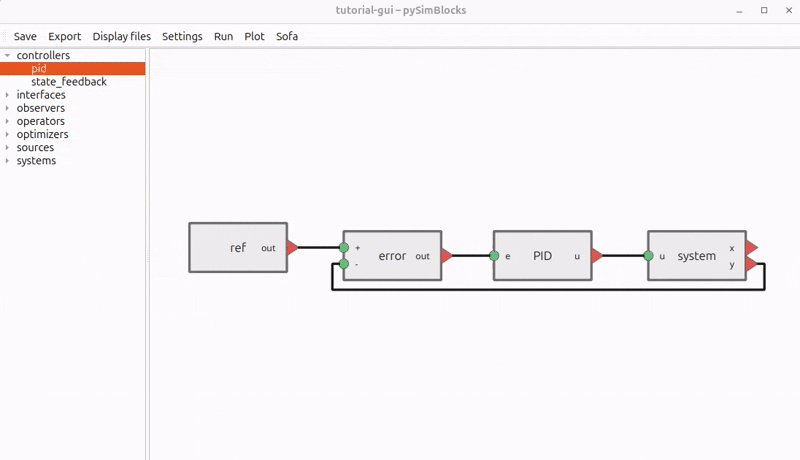

pySimBlocks Documentation
=========================

.. raw:: html

   

     <a href="https://github.com/AlessandriniAntoine/pySimBlocks">GitHub</a>
     &nbsp;|&nbsp;
     <a href="https://pypi.org/project/pySimBlocks/">PyPI</a>
   

pySimBlocks is a block-diagram simulation framework for control-oriented
workflows. You can build models directly in Python or assemble them visually in
the graphical editor, then run the same discrete-time simulation engine in both
cases.

The documentation is organized to help different kinds of readers get to the
right page quickly.

Key Features
------------

- Block-diagram modeling in Python with explicit signal connections
- Graphical editor for building and configuring models visually
- Shared discrete-time execution engine across Python and GUI workflows
- YAML project files and exportable Python runners
- Logging, plotting, and project-based simulation workflows
- Optional SOFA integration for coupled simulation

Where Should I Start?
---------------------

- If you want to install pySimBlocks and run a first example, start with
  :doc:`user_guide/installation` and :doc:`user_guide/quick_start`.
- If you want a guided learning path, continue with
  :doc:`user_guide/tutorials/index`.
- If you want to work primarily from Python code, the tutorials begin with a
  pure Python example before moving to the GUI.
- If you want the reference for modules, classes, and functions, go to
  :doc:`api/index`.

Documentation Overview
----------------------

- The User Guide covers installation, a quick start, and progressive tutorials.
- The API Reference documents the Python package structure and public objects.

.. toctree::
   :maxdepth: 2
   :caption: Contents

   user_guide/index
   api/index
