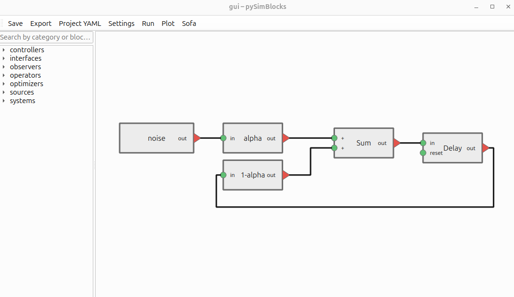

# Quick Start

This quick start shows how to build and run a simple first-order low-pass
filter with `pySimBlocks`, first with the Python API and then with the
graphical editor.

## Python API example

The following example models a simple first-order low-pass filter defined by:

$$
y[k] = \alpha x[k] + (1-\alpha) y[k-1]
$$

```{literalinclude} ../../../examples/quick_start/filter.py
:language: python
:caption: examples/quick_start/filter.py
```

The resulting plot should look like this:


## Graphical editor

The same model can also be created visually with the graphical editor.



To open the graphical editor with the quick-start project:

```bash
pysimblocks gui examples/quick_start/gui
```

## Downloads

You can download or view the quick-start example files here:

- [`filter.py`](../../../examples/quick_start/filter.py)
- [`project.yaml`](../../../examples/quick_start/gui/project.yaml)

If you have cloned the repository, the files are in `examples/quick_start/`.
