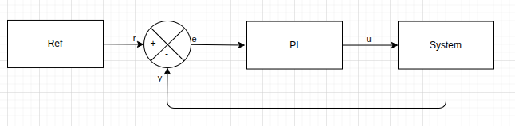

# Tutorial 1: First Steps with pySimBlocks

## Overview

This tutorial introduces the core concepts of `pySimBlocks`:

- Creating blocks
- Connecting signals
- Running a discrete-time simulation
- Logging and plotting results

By the end of this tutorial, you will be able to build and simulate your own
block-based model in Python.

## System Description

We build a simple closed-loop control system composed of three elements:

- A step reference
- A PI controller
- A first-order discrete-time linear plant



The plant is a discrete-time first-order linear system defined by:

$$
\begin{array}{rcl}
x[k+1] &=& a\,x[k] + b\,u[k] \\
y[k] &=& x[k]
\end{array}
$$

The initial state is $x[0] = 0$.

The PI controller computes a control command from the tracking error
$e[k] = r[k] - y[k]$:

$$
u[k] = K_p\, e[k] + x_i[k]
$$

with the integral state evolving as:

$$
x_i[k+1] = x_i[k] + K_i\, e[k]\, dt
$$

This integral action removes steady-state error for a step reference.

## Complete Example

The full example is available in
[`examples/tutorials/tutorial_1_python/main.py`](../../../examples/tutorials/tutorial_1_python/main.py).

```{literalinclude} ../../../examples/tutorials/tutorial_1_python/main.py
:language: python
:caption: examples/tutorials/tutorial_1_python/main.py
```

## How It Works

The example follows a simple workflow:

1. Blocks are created.
2. Blocks are added to a `Model`.
3. Signals are connected explicitly.
4. A `Simulator` executes the model in discrete time.
5. Selected signals are logged and retrieved for plotting.

This reflects the core philosophy of `pySimBlocks`: explicit block modeling
with deterministic discrete-time execution.

## About Signal Shapes

All signals in `pySimBlocks` follow a strict 2D convention:

- Scalars are represented as `(1, 1)`
- Vectors are `(n, 1)`
- Matrices are `(m, n)`

When logging a SISO signal over time, the resulting array has shape
`(N, 1, 1)`, where `N` is the number of simulation steps.

For plotting convenience, the example uses:

```python
y = sim.get_data("system.outputs.y").squeeze()
```

## Try It Yourself

To explore the framework further, try:

- Changing the controller gains `Kp` and `Ki`
- Modifying the system dynamics `A` and `B`
- Adjusting the time step `dt`
- Increasing the simulation duration `T`

Observe how the closed-loop response changes.
