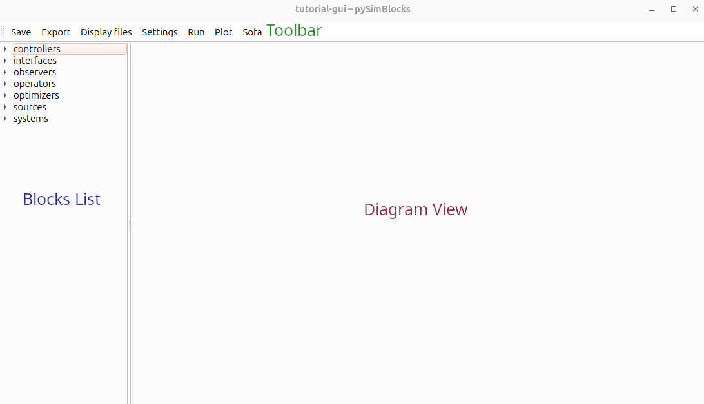
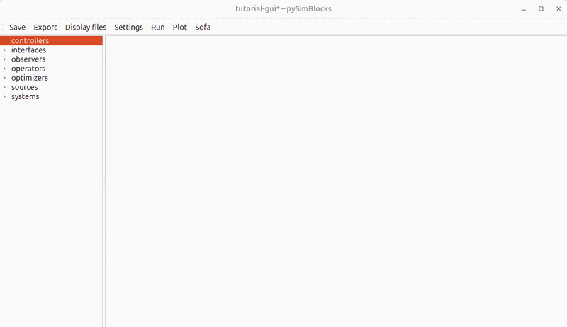
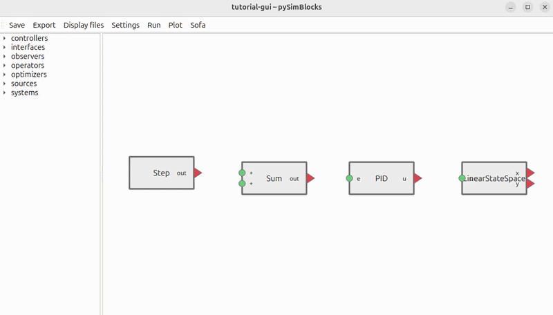
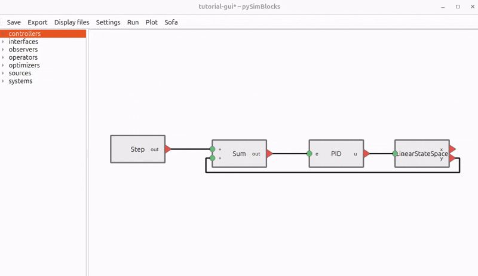
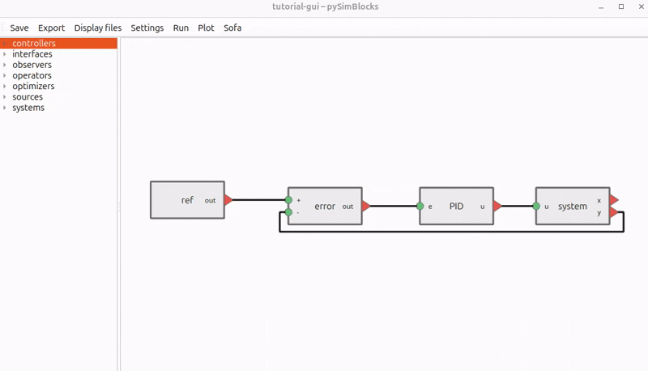

# Tutorial 2: Building a Model with the GUI

In this tutorial, we rebuild the same closed-loop system as in
[Tutorial 1](./tutorial_1_python.md), but using the graphical editor.

## Goals

The objective is to:

- Add blocks visually
- Configure their parameters
- Connect signals
- Run the simulation
- Save and export the project

By the end of this tutorial, you will be able to build and simulate your own
block-based model with the GUI.

## System Reminder

We build a simple closed-loop control system composed of three elements:

- A step reference
- A PI controller
- A first-order discrete-time linear plant


## Step-by-Step Construction

### Create a New Project

Create a new project folder and start the GUI:

```bash
mkdir tutorial-gui
cd tutorial-gui
pysimblocks gui
```

The main window opens, with the toolbar at the top, the block list on the
left, and the diagram view on the right.



### Add the Blocks

Add the required blocks to the diagram:

1. Double-click a category in the block list to expand it.
2. Drag the selected block into the diagram view.
3. Repeat this for all required blocks and arrange them on the canvas.



Notes:

- Press `Space` in the diagram view to center the view on all blocks.
- Select a block and press `Ctrl+R` to rotate it.

### Connect the Blocks

Input ports are represented by circles and output ports by triangles.

To create a connection, select a port and drag the connection to the target
port. While dragging, a dashed line appears. The line becomes solid once the
connection is valid.



The ports must be of different types: output to input.

### Configure the Parameters

Configure both the blocks and the simulation settings.

#### Block Parameters

Open a block dialog by double-clicking the block.

Set the following parameters:

| Block | Parameter | Value |
| --- | --- | --- |
| LinearStateSpace | A | 0.9 |
| LinearStateSpace | B | 0.5 |
| LinearStateSpace | C | 1.0 |
| LinearStateSpace | x0 | 0. |
| PID | controller | PI |
| PID | Kp | 0.5 |
| PID | Ki | 2. |
| Sum | signs | +- |

If you rename the blocks, use the same names as in
[Tutorial 1](./tutorial_1_python.md): `ref`, `error`, `PID`, and `system`.



Notes:

- Scalars are represented as `(1,1)` arrays.
- You can define vectors or matrices with Python-like nested lists such as
  `[[0.5], [0.3]]`.
- Use the Help button for a description of the selected block.

#### Simulation Settings

Open the simulation settings from the toolbar and configure:

- Sample time: `0.01` s
- Duration: `5` s
- Signals to log: `system.outputs.y`, `PID.outputs.u`, and `ref.outputs.out`

You can also define custom plots in the plots panel for quick access after the
simulation.


Click `Apply` before switching panels, otherwise the changes are not saved.

### Run the Simulation and Visualize the Results

Once all parameters are configured, run the simulation with the toolbar run
button.

Then open the plot dialog to either:

- Plot selected logged signals in a single graph
- Open one of your predefined plots



Under the hood, the GUI generates the same `Model` structure used in
[Tutorial 1](./tutorial_1_python.md). The execution engine is the same.

## Save and Export Project Files

### Save the Project

Saving from the toolbar creates a `project.yaml` file in the current folder.

This file contains:

- Project metadata
- Simulation settings
- Block diagram data
- GUI layout information

This single file fully describes the model and can be reloaded in the GUI or
executed programmatically.

### Export a Python Runner

The `Export` button generates a `run.py` file.

This script loads `project.yaml`, rebuilds the corresponding `Model`, and runs
the simulation from the command line:

```bash
python run.py
```

## Example File

If you want to compare your result with a completed version, you can download
or view the project files here:

- [`project.yaml`](../../../../examples/tutorials/tutorial_2_gui/project.yaml)
- [`run.py`](../../../../examples/tutorials/tutorial_2_gui/run.py)

If you have cloned the repository, the full reference project lives in
`examples/tutorials/tutorial_2_gui/`.

## Comparison with the Python Version

The system built in this tutorial is identical to the one created manually in
[Tutorial 1](./tutorial_1_python.md).

In the Python version:

- Blocks are instantiated in code
- Connections are created with `model.connect(...)`
- The simulator is built directly

In the GUI version:

- The diagram is created visually
- The configuration is stored as YAML
- Export generates a Python runner from that configuration

In both cases, the execution engine is the same.

## Try It Yourself

Experiment with the model to better understand the GUI workflow:

- Modify the controller gains `Kp` and `Ki`
- Change the system dynamics `A` and `B`
- Adjust the sample time or simulation duration
- Create additional custom plots
- Rename blocks and reorganize the layout

After modifying the model, save the project and export a new `run.py` file to
verify that the exported script reproduces the same behavior.
