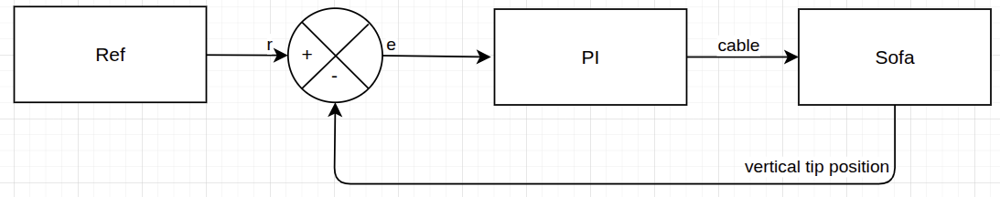
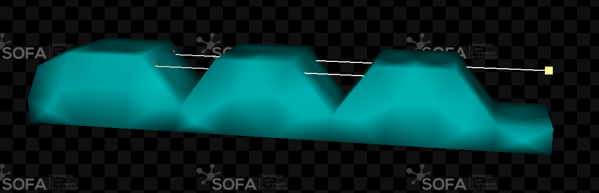
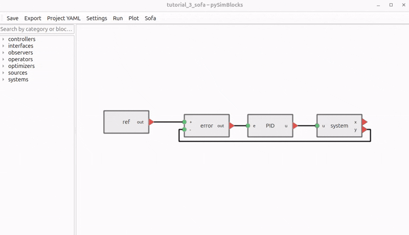
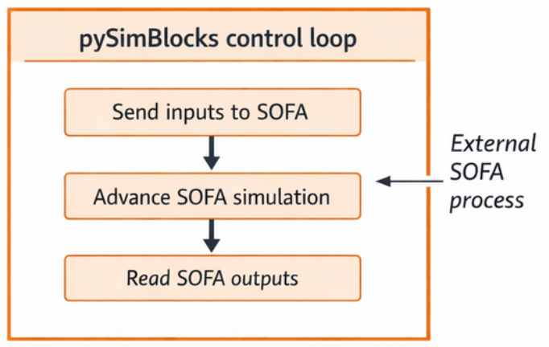
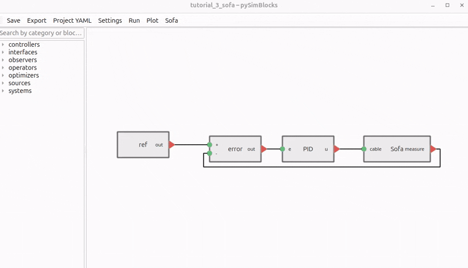
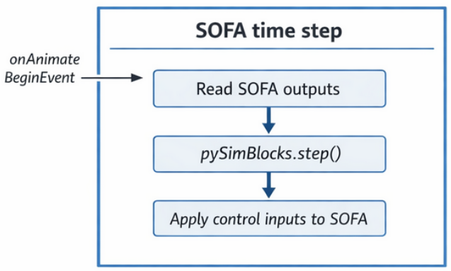
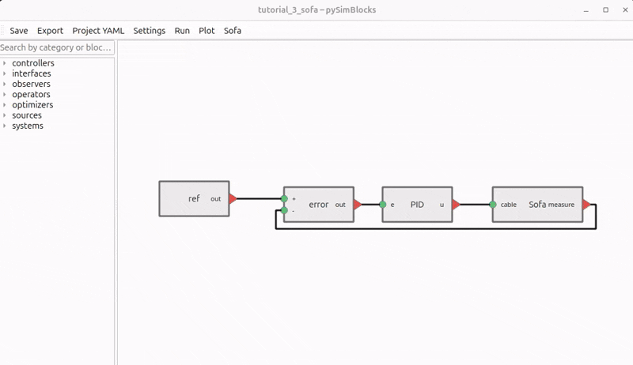
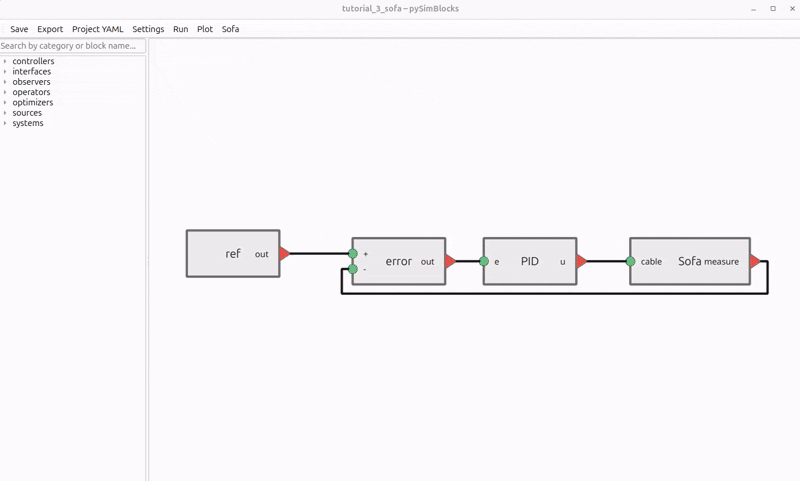

# Tutorial 3: Coupling pySimBlocks with SOFA

This tutorial builds on [Tutorial 1](./tutorial_1_python.md) and
[Tutorial 2](./tutorial_2_gui.md). The linear plant is replaced with a SOFA
scene so the controller interacts with a physics-based simulation.

## Goals

The objective is to:

- Configure the environment needed to run SOFA from `pySimBlocks`
- Replace the plant with a `SofaPlant` block
- Create a SOFA controller that exchanges signals with the block diagram
- Run the coupled model in both execution modes

By the end of this tutorial, you will be able to connect a `pySimBlocks`
control loop to a SOFA simulation.

## Example Files

You can download or view the main project files here:

- [`finger/Finger.py`](../../../../examples/tutorials/tutorial_3_sofa/finger/Finger.py): SOFA scene
- [`finger/FingerController.py`](../../../../examples/tutorials/tutorial_3_sofa/finger/FingerController.py): SOFA controller
- [`project.yaml`](../../../../examples/tutorials/tutorial_3_sofa/project.yaml): GUI project file

To run the scene you also need the mesh files and additional assets bundled in
the complete archive:

{download}`Download tutorial_3_sofa.zip <../../_static/downloads/tutorial_3_sofa.zip>`

If you have cloned the repository, the full example lives in
`examples/tutorials/tutorial_3_sofa/`.

## System Description

We build the same closed-loop structure as in the previous tutorials:

- A constant reference
- A PI controller
- A SOFA simulation of a tendon-driven finger



The control input is the cable actuation, and the measured output is the
vertical fingertip position.



## Prerequisites

Before coupling `pySimBlocks` with SOFA, make sure:

- SOFA is installed
- Python can import `Sofa`
- `runSofa` is available through `SOFA_ROOT`

`pySimBlocks` has been tested with SOFA `v24.06` and later.

### Linux and macOS

```bash
export SOFA_ROOT=/path/to/your/sofa

# Binary release:
export PYTHONPATH=$SOFA_ROOT/plugins/SofaPython3/lib/python3/site-packages:$PYTHONPATH

# Built from source:
# export PYTHONPATH=$SOFA_ROOT/lib/python3/site-packages:$PYTHONPATH
```

### Windows

```powershell
$env:SOFA_ROOT = "C:\path\to\your\sofa"

# Binary release:
$env:PYTHONPATH = "$env:SOFA_ROOT\plugins\SofaPython3\lib\python3\site-packages;$env:PYTHONPATH"

# Built from source:
# $env:PYTHONPATH = "$env:SOFA_ROOT\lib\python3\site-packages;$env:PYTHONPATH"
```

### Verify the Setup

Check that Python can import SOFA:

```python
import Sofa
import SofaRuntime
```

Then verify that `runSofa` is available:

- Linux and macOS: `$SOFA_ROOT/bin/runSofa`
- Windows: `$env:SOFA_ROOT\bin\runSofa.exe`

## SOFA Controller Contract

To exchange data between the diagram and the SOFA scene, subclass
`SofaPysimBlocksController` from `pySimBlocks.blocks.systems.sofa`.

Your controller must define:

- `self.project_yaml`
- `self.dt`
- `self.inputs`
- `self.outputs`

It must implement:

- `set_inputs()`
- `get_outputs()`

### Example Controller

The tutorial example uses the following controller:
```{literalinclude} ../../../../examples/tutorials/tutorial_3_sofa/finger/FingerController.py
:language: python
:caption: examples/tutorials/tutorial_3_sofa/finger/FingerController.py
```

The scene must instantiate that controller and return it from `createScene(...)`
alongside the root node.

## Configure the SofaPlant Block

In the GUI, replace the `LinearStateSpace` block from the previous tutorials
with a `SofaPlant` block from the Systems category.



Set the block parameters as follows:

| Parameter | Value |
| --- | --- |
| `scene_file` | `finger/Finger.py` |
| `input_keys` | `["cable"]` |
| `output_keys` | `["measure"]` |
| `slider_params` | `{"ref.value": [-10.0, 50.0], "PID.Kp": [0.01, 3.0], "PID.Ki": [0.01, 3.0]}` |

The key names must match the dictionaries declared in the SOFA controller.

## Execution Modes

### pySimBlocks as Master

In this mode, `pySimBlocks` drives the clock. The `SofaPlant` block runs SOFA
headlessly and advances it by one step at each control iteration.



Run the model as you would in [Tutorial 2](./tutorial_2_gui.md), either from
the GUI or from the exported Python runner.



### SOFA as Master

In this mode, SOFA drives the clock and the controller triggers the
`pySimBlocks` diagram during the SOFA animation loop.



Open the SOFA panel from the toolbar and click `runSofa` to launch the scene
with the SOFA GUI.



## Live Sliders and Plots

If your SOFA installation includes the Compliance Robotics GUI, the parameters
declared in `slider_params` become live sliders in SOFA, and the plots defined
in the `pySimBlocks` project are displayed live in the same window.



This makes it possible to tune `ref.value`, `PID.Kp`, and `PID.Ki` while the
simulation is running.

## Try It Yourself

Experiment with the coupled model to better understand the workflow:

- Modify `Kp` and `Ki` and compare the tracking behavior
- Change the reference and observe the fingertip response
- Run the same project with both execution modes
- If available, use the live SOFA sliders and plots for real-time tuning
